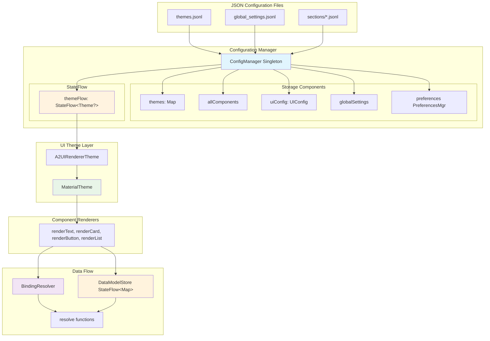
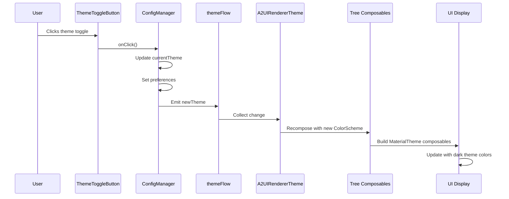
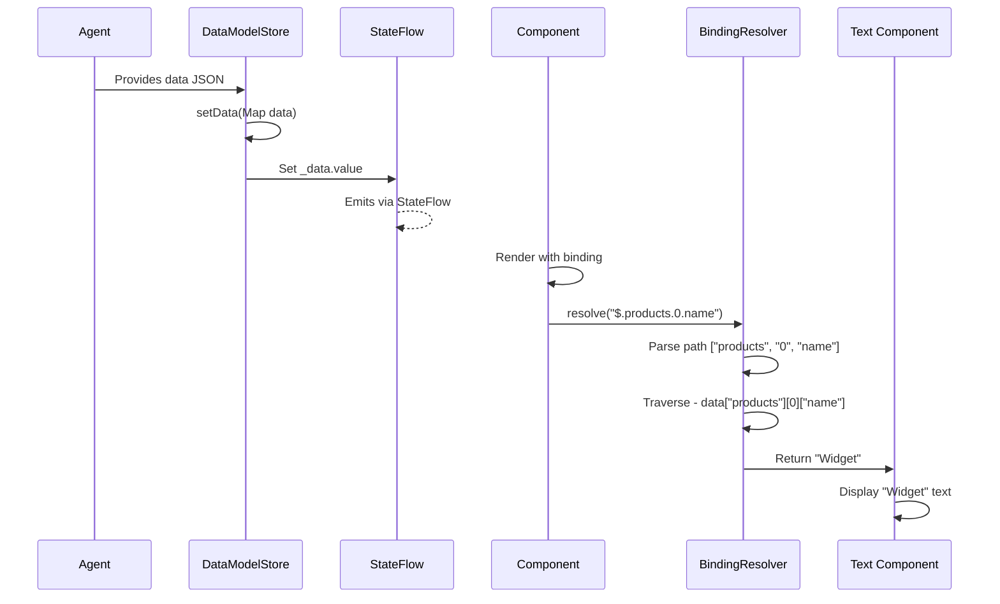
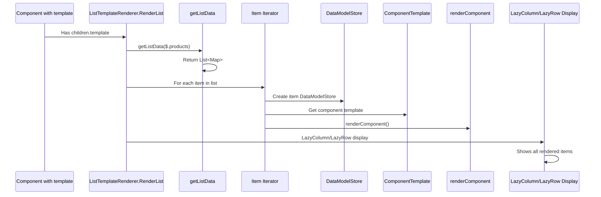
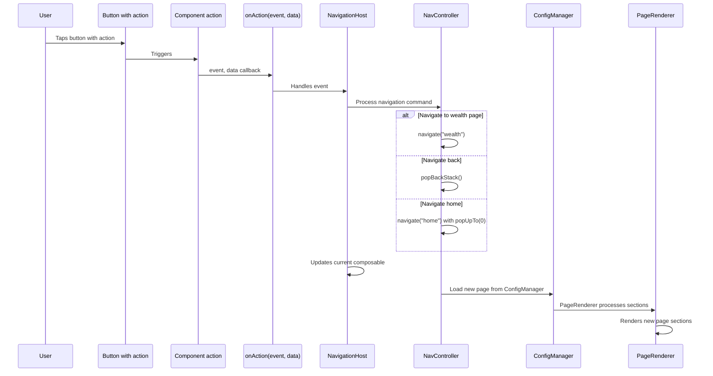

# A2UI Renderer - Architecture Documentation

## Overview

This document defines the complete architecture of the A2UI Renderer, including data flow, component structure, state management, and navigation patterns.

---

## Architecture Decision

> **Local-First Configuration**: Server communication is intentionally **LOW PRIORITY**. All configuration is stored locally in `res/raw/*.jsonl` files. This is a valid implementation choice for offline-first or embedded renderer scenarios.

---

## High-Level Architecture

```
┌─────────────────────────────────────────────────────────────────┐
│                    JSON Configuration Files                      │
│  themes.jsonl │ global_settings.jsonl │ sections/*.jsonl        │
└────────────────────┬────────────────────────────────────────────┘
                     │ Load at init
                     ▼
┌─────────────────────────────────────────────────────────────────┐
│                      ConfigManager (Singleton)                  │
│  ┌────────────────┐  ┌──────────────────┐  ┌─────────────────┐ │
│  │ themes: Map    │  │ uiConfig: UIConfig│  │ preferences     │ │
│  │ allComponents  │  │ globalSettings   │  │ PreferencesMgr  │ │
│  └────────────────┘  └──────────────────┘  └─────────────────┘ │
│                                                                 │
│  ┌──────────────────────────────────────────────────────────┐  │
│  │ themeFlow: StateFlow<Theme?>                             │  │
│  │ • Emits when theme changes                               │  │
│  │ • Observed by A2UIRendererTheme                          │  │
│  │ • Persists to SharedPreferences                          │  │
│  └──────────────────────────────────────────────────────────┘  │
└──────────────┬──────────────────────────────────────────────────┘
               │ themeFlow.collectAsState()
               ▼
┌─────────────────────────────────────────────────────────────────┐
│                   A2UIRendererTheme (Composable)                │
│  • Observes themeFlow                                          │
│  • Builds ColorScheme from theme.colors                        │
│  • Builds Typography from theme.typography                     │
│  • Provides MaterialTheme to children                          │
└──────────────┬──────────────────────────────────────────────────┘
               │ MaterialTheme.current
               ▼
┌─────────────────────────────────────────────────────────────────┐
│                    Component Renderers                          │
│  renderText() │ renderCard() │ renderButton() │ renderList()   │
│  • Access MaterialTheme.colorScheme                            │
│  • Access MaterialTheme.typography                             │
│  • Resolve bindings via BindingResolver                        │
│  • Apply validation rules                                      │
└──────────────┬──────────────────────────────────────────────────┘
               │
               ▼
┌─────────────────────────────────────────────────────────────────┐
│              DataModelStore + BindingResolver                   │
│  ┌──────────────────┐         ┌─────────────────────────────┐  │
│  │ _data:StateFlow  │◄───────►│ resolve("$.user.name")      │  │
│  │ setData()        │         │ updateAtPath()              │  │
│  │ getAtPath()      │         │ resolveText()               │  │
│  └──────────────────┘         └─────────────────────────────┘  │
└─────────────────────────────────────────────────────────────────┘
```

### Multi-Page Journey Configuration Flow Mermaid Version

```mermaid
graph LR
    subgraph "ConfigManager Integration"
        CM[ConfigManager.getPage()]
        J[journeyId: banking_journey]
        P[pageId: homepage]
    end
    
    subgraph "Navigation Host Layer" 
        NH[NavigationHost with Compose Navigation]
        SH[startDestination homepage]
        SR[Screen routes - Homepage, Wealth]
    end
    
    subgraph "Page Routes"
        HP[homepage]
        WH[wealth - Secondary]
        NB[navigate between pages]
    end
    
    subgraph "Page Config Objects"
        PC[PageConfig object]
        ID[id pageId journeyId]
        SEC[sections List&lt;SectionConfig&gt;]
        SB[statusBar StatusBarConfig]
        NB[navBar NavigationBarConfig]
    end
    
    subgraph "Page Renderer.kt"
        PR[PageRenderer renders all sections]
        TN[top navigation sections]
        CC[content Column/LazyColumn sections] 
        BN[bottom navigation sections]
    end
    
    CM --> J
    CM --> P
    J --> NH
    P --> NH
    NH --> HP
    HP --> WH
    HP -.-> NB
    WH -.-> NB
    
    HP --> PC
    WH --> PC
    PC --> SEC
    SEC --> PR
    PC --> SB
    PC --> NB
    SB --> PR
    NB --> PR
    PR --> TN
    PR --> CC
    PR --> BN
    
    style CM fill:#e1f5fe
    style NH fill:#fff3e0
    style PC fill:#e8f5e8
    style PR fill:#f2e5f5
```

### High-Level Architecture Mermaid Version



---

## Core Components

### ConfigManager

**Purpose**: Configuration loader and provider (separation of concerns from form engine)

**Responsibilities**:
- Load JSON configuration from `res/raw/*.jsonl`
- Provide component lookup by ID and JSON parsing
- Handle theme persistence via `PreferencesManager`
- Pass configuration objects to the Form Engine for form-specific handling

**Key Properties**:
```kotlin
object ConfigManager {
    private var themes: Map<String, Theme> = emptyMap()
    private var allComponents: Map<String, ComponentConfig> = emptyMap()
    private var currentTheme: Theme? = null
    private var journeys: Map<String, JourneyConfig> = emptyMap()
    
    private val _themeFlow = MutableStateFlow<Theme?>(null)
    val themeFlow: StateFlow<Theme?> = _themeFlow.asStateFlow()
    
    private var preferencesManager: PreferencesManager? = null
}
```

**Key Methods**:
```kotlin
fun init(context: Context)
fun getCurrentTheme(): Theme?
fun setTheme(themeId: String)
fun getComponent(componentId: String): ComponentConfig?
fun getJourney(journeyId: String): JourneyConfig?
fun getAllComponents(): Map<String, ComponentConfig>
fun resolveColor(token: String?): String?
fun resolveSpacing(token: String?): Dp
```

---

### FormEngine (NEW)

**Purpose**: Central form state management and orchestration hub

**Responsibilities**:
- Single source of truth for UI form state across components/pages
- Manage deterministic evaluation order for form expressions and dependencies
- Handle incremental re-evaluation using explicit dependency graphs and namespaces
- Provide centralized evaluation and caching for dynamic choices and pre-choice rules
- Manage consistent error maps and dirty validation behavior
- Control data updates backed by DataModelStore
- Provide derived state maps (visibility, enabled/readonly, errors, choice)
- Maintain dependency matrix and orchestrate evaluation order
- Handle action dispatch (including navigation decisions like next View IdRule)
- Coordinate state flow between pages in a journey

**Key Properties And State Structure**:
```kotlin
object FormEngine {
    // Single source of truth for UI form state
    private val _formStateFlow = MutableStateFlow<FormState>(FormState.Initial())
    val formStateFlow: StateFlow<FormState> = _formStateFlow.asStateFlow()
    
    // Separate dirty state flow
    private val _dirtyStateFlow = MutableStateFlow<DirtyState>(DirtyState.Empty())
    val dirtyStateFlow: StateFlow<DirtyState> = _dirtyStateFlow.asStateFlow()
    
    // Explicit error state management
    private val _errorStateFlow = MutableStateFlow<ErrorState>(ErrorState.Empty())
    val errorStateFlow: StateFlow<ErrorState> = _errorStateFlow.asStateFlow()
    
    // Dependency Matrix - tracks all dependencies between elements
    private val _dependencyMatrix: DependencyMatrix = DependencyMatrix()
    
    // Evaluation caches for different namespaces (validation, binding, visibility, etc)
    private val evaluationCaches: Map<EvaluationNamespace, EvaluationCache> = createNamespacedCaches()
    
    // DataModelStore dependency (engine controls updates)
    private val _dataModelStore = DataModelStore()
    
    // Current active journey/page configuration
    private var currentJourney: JourneyConfig? = null
    private var currentPageId: String = ""
    
    // Navigation state management
    private val _navigationState = mutableStateOf(NavigationState.Idle)
    private val availableTransitions: Map<ViewIdRule, NavigationAction> = mutableMapOf()
}
```

**Form State Management (Single Source of Truth)**:
```kotlin
data class FormState(
    val values: Map<String, Any?>,           // All form values (key path -> value)
    val dirtyFlags: Map<String, Boolean>,    // Track dirty state per value
    val touchedFlags: Map<String, Boolean>,  // Track touch state per value
    val visitedOrder: List<String>,          // Order in which values were visited
    val lastUpdateTimestamp: Map<String, Long> // Last modification timestamps
) {
    companion object {
        fun Initial(): FormState = FormState(
            values = emptyMap(),
            dirtyFlags = emptyMap(),
            touchedFlags = emptyMap(),
            visitedOrder = emptyList(),
            lastUpdateTimestamp = emptyMap()
        )
    }
    
    fun withValueAt(path: String, value: Any?): FormState {
        val currentTime = System.currentTimeMillis()
        return copy(
            values = values + (path to value),
            lastUpdateTimestamp = lastUpdateTimestamp + (path to currentTime),
            dirtyFlags = dirtyFlags + (path to true) // Mark as dirty when updated
        )
    }
}
```

**Dependency Matrix**:
```kotlin
class DependencyMatrix {
    // Track which elements affect others (e.g., dependency expressions)
    private val affectingDependencies: Map<String, Set<String>> = mutableMapOf()
    
    // Track which elements are affected by others
    private val affectedDependencies: Map<String, Set<String>> = mutableMapOf()
    
    fun addDependency(depender: String, dependency: String, type: DependencyType) {
        val dependencies = affectingDependencies.getOrDefault(depender, emptySet())
        affectingDependencies[depender] = dependencies + dependency
        
        val affects = affectedDependencies.getOrDefault(dependency, emptySet())
        affectedDependencies[dependency] = affects + depender
    }
    
    fun getDirectDependers(elementPath: String): Set<String> {
        return affectingDependencies[elementPath] ?: emptySet()
    }
    
    fun getAffectedElements(elementPath: String): Set<String> {
        return affectedDependencies[elementPath] ?: emptySet()
    }
    
    fun getTransitiveAffectedElements(elementPath: String): Set<String> {
        // Use recursive traversal with cycle detection
        return traverseAffectedTransitively(elementPath, mutableSetOf())
    }
    
    enum class DependencyType {
        VALIDATION, VISIBILITY, ENABLEMENT, VALUE_DEPENDENCY
    }
}
```

**Evaluation Engine (for deterministic evaluation)**:
```kotlin
class EvaluationEngine(private val formEngine: FormEngine) {
    
    // Ensure deterministic evaluation order
    private val evaluationOrder: Map<EvaluationType, List<String>> = mutableMapOf()
    
    // Namespaces for different evaluation purposes (validation, ui props, etc)
    enum class EvaluationNamespace {
        VALIDATION,
        VISIBILITY,
        ENABLEMENT, 
        BOUND_VALUES,
        DYNAMIC_OPTIONS
    }
    
    // Cache for results of expensive evaluations
    private val evaluationCaches: Map<EvaluationNamespace, EvaluationCache> = mutableMapOf(
        EvaluationNamespace.VALIDATION to EvaluationCache(ttlMs = 5000), // 5 second ttl
        EvaluationNamespace.VISIBILITY to EvaluationCache(ttlMs = 1000), // 1 second ttl
        EvaluationNamespace.ENABLEMENT to EvaluationCache(ttlMs = 1000), // 1 second ttl
        EvaluationNamespace.BOUND_VALUES to EvaluationCache(ttlMs = 3000), // 3 second ttl
        EvaluationNamespace.DYNAMIC_OPTIONS to EvaluationCache(ttlMs = 10000) // 10 second ttl
    )
    
    fun evaluateExpression(
        expression: String, 
        namespace: EvaluationNamespace, 
        contextPath: String
    ): Any? {
        val cache = evaluationCaches[namespace] ?: return null
        
        // Try cache first
        cache.get(expression, contextPath)?.let { return it }
        
        // Then evaluate
        val result = actuallyEvaluate(expression, namespace, contextPath)
        
        // Cache the result
        if (namespace in listOf(EvaluationNamespace.BOUND_VALUES, EvaluationNamespace.DYNAMIC_OPTIONS)) {
            cache.put(expression, contextPath, result, namespace)
        }
        
        return result
    }
    
    fun evaluateInIncrementalOrder(
        changes: Map<String, Any?>,
        changedNamespace: EvaluationNamespace
    ) {
        // Get dependency-ordered evaluation sequence
        val orderedEvaluationKeys = formEngine.dependencyMatrix
            .getTransitiveAffectedElementsBulk(changes.keys)
            .sortedBy { evaluationOrder[changedNamespace]?.indexOf(it) ?: Int.MAX_VALUE }
        
        // Evaluate in deterministic order
        orderedEvaluationKeys.forEach { key ->
            if (changes.containsKey(key)) {
                // Re-evaluate dependencies of changed element
                evaluateElementDependencies(key, changedNamespace)
            } else {
                // Check if this element depends on the changed value
                evaluateIfDependsOn(changes, key, changedNamespace)
            }
        }
    }
}
```

**State Orchestrations: Validation and Error Behavior**:
```kotlin
class ValidationStateOrchestrator(
    private val formEngine: FormEngine,
    private val evaluationEngine: EvaluationEngine
) {
    
    fun runValidationOnPath(path: String) {
        val elementConfig = getElementConfig(path)
        
        // Collect validation rules for the specific path
        val validationRules = elementConfig.validationRules
        
        // Run each validation rule and accumulate results
        val errors = mutableListOf<ValidationError>()
        
        validationRules.forEach { rule ->
            val evaluationResult = evaluationEngine.evaluateExpression(
                rule.expression,
                EvaluationNamespace.VALIDATION,
                path
            )
            
            if (!isRuleFulfilled(rule, evaluationResult)) {
                errors.add(ValidationError(
                    path = path,
                    ruleType = rule.type,
                    message = resolveErrorTemplate(rule.errorTemplate),
                    severity = rule.severity
                ))
            }
        }
        
        // Update error state for the form engine
        formEngine._errorStateFlow.value = formEngine._errorStateFlow.value
            .withValidationErrors(path, errors)
            
        // Update dirty state
        formEngine._dirtyStateFlow.value = formEngine._dirtyStateFlow.value
            .markFieldValidated(path)
    }
    
    fun runValidationOnAllChangedFields(): List<ValidationError> {
        val result = mutableListOf<ValidationError>()
        
        // Only validate fields that have changed since last validation
        val changedSinceLastValidation = getChangedFieldSinceLastValidation()
        
        changedSinceLastValidation.forEach { path ->
            val errors = runValidationOnPath(path)
            result.addAll(errors)
        }
        
        return result
    }
}
```

**Action Dispatcher (Including Navigation Decisions)**:
```kotlin
class ActionDispatcher(
    private val formEngine: FormEngine,
    private val journeyManager: JourneyManager
) {
    
    fun dispatchAction(action: FormAction): ActionResult {
        return when (action) {
            is UpdateValueAction -> {
                handleValueUpdate(action)
            }
            is ValidateAction -> {
                handleValidationRequest(action)
            }
            is NavigationAction -> {
                handleNavigationRequest(action)
            }
            is SubmitAction -> {
                handleSubmitRequest(action)
            }
            is ResetAction -> {
                handleResetRequest(action)
            }
        }
    }
    
    private fun handleNavigationRequest(action: NavigationAction): ActionResult {
        val destinationId = when(action.rule) {
            is ViewIdRule.Direct -> action.rule.destinationId
            is ViewIdRule.Conditional -> {
                val evaluationResult = evaluationEngine.evaluateExpression(
                    action.rule.conditionExpression,
                    EvaluationNamespace.VALIDATION,
                    "navigation_condition_${System.nanoTime()}"
                )
                
                action.rule.getDestinationBasedOn(evaluationResult)
            }
            is ViewIdRule.Dynamic -> {
                // Look up next View ID based on current form state
                findNextViewIdFromCurrentState(action.rule.logic)
            }
        }
        
        return journeyManager.navigateToPage(destinationId)
    }
    
    // Additional navigation utilities that consider form state
    fun shouldAllowNavigationTo(viewId: String): Boolean {
        val requiredFields = getRequiredFieldConfigsForView(viewId)
        val currentFormState = formEngine.formStateFlow.value
        
        // Check if all required fields in the current view are satisfied
        return requiredFields.all { field -> 
            currentFormState.dirtyFlags[field.id] == true ||
            formEngine.errorStateFlow.value.hasNoErrors(field.id)
        }
    }
}
```

**Integration with Existing DataModelStore**:
```kotlin
class FormDataModelAdapter(private val formEngine: FormEngine) {
    
    // Engine controls updates to DataModelStore
    fun updateDataModelWithEngineState() {
        val formState = formEngine.formStateFlow.value
        val dataMap = mapFormStateToData(formState.values)
        
        // Send updates to DataModelStore from engine-controlled data
        formEngine._dataModelStore.setData(dataMap)
    }
    
    // Sync data model changes back to form engine state (when needed)
    fun listenToDataModelChanges(syncCallback: (DataModelStore) -> Unit) {
        // Observe DataModelStore flow and sync back to form engine
        formEngine._dataModelStore.data.value.observe { newData ->
            // Handle changes from DataModelStore back to form engine
            // This could come from external sources
            syncFormStateWithNewData(newData)
        }
    }
    
    private fun mapFormStateToData(formStateValues: Map<String, Any?>): Map<String, Any> {
        val result = mutableMapOf<String, Any>()
        formStateValues.forEach { (path, value) ->
            // Convert form engine path structure to DataModelStore format
            val dataPath = convertToDataModelPath(path)
            result[dataPath] = value ?: "null_value_sentinel_$dataPath"
        }
        return result
    }
}
```

**Form State Interface Methods**:
```kotlin
object FormEngine {
    
    // Primary public methods for interaction
    suspend fun updateValue(elementId: String, newValue: Any?, source: ChangeSource) {
        _formStateFlow.value = _formStateFlow.value.withValueAt(elementId, newValue)
        markDirty(elementId)
        
        // Trigger incremental evaluation of dependent elements
        triggerDependencyEvaluation(setOf(elementId))
    }
    
    fun setInitialFormState(initial: FormState) {
        _formStateFlow.value = initial
        _dirtyStateFlow.value = DirtyState.Initial()
    
        // Seed dependency matrix from initial config
        seedDependenciesFromInitialConfig()
    }
    
    fun validateAll(): ValidationResult {
        val fieldConfigs = getCurrentFieldConfigs()
        
        fieldConfigs.forEach { config ->
            validateField(config.id)
        }
        
        return ValidationResult(
            hasErrors = _errorStateFlow.value.hasAnyErrors(),
            errors = _errorStateFlow.value.getAllErrors(),
            fieldCount = fieldConfigs.size
        )
    }
    
    fun validateField(elementId: String): ValidationSubresult {
        return validationStateOrchestrator.runValidationOnPath(elementId)
    }
    
    fun canNavigateTo(destinationId: String): Boolean {
        return actionDispatcher.shouldAllowNavigationTo(destinationId)
    }
    
    // Get current state snapshots
    fun getCurrentValueAtPath(path: String): Any? {
        return _formStateFlow.value.values[path]
    }
    
    fun getLastErrorForPath(path: String): ValidationError? {
        return _errorStateFlow.value.getMostRecentError(path)
    }
    
    fun getDirtyFields(): Set<String> {
        return _formStateFlow.value.dirtyFlags.filter { it.value }.keys
    }
        
    // Lifecycle management for integration with JourneyManager
    fun startJourney(journey: JourneyConfig) {
        currentJourney = journey
        resetFormState()
    }
    
    fun leaveCurrentPage() {
        // Preserve form state but mark fields as inactive
        preserveStateForReturn()
    }
    
    fun restoreStateForPage(pageId: String) {
        restoreStateFromJourneyHistory(pageId)
    }
}
```

---

### A2UIRendererTheme

**Purpose**: Theme provider composable that observes `themeFlow` and provides MaterialTheme

**Implementation**:
```kotlin
@Composable
fun A2UIRendererTheme(
    darkTheme: Boolean = isSystemInDarkTheme(),
    content: @Composable () -> Unit
) {
    val currentTheme = ConfigManager.themeFlow.collectAsState(initial = null).value
    
    val colorScheme = if (currentTheme?.mode == "dark") {
        darkColorScheme(
            primary = Color(0xFFFF5252),
            secondary = Color(0xFF64B5F6),
            background = Color(0xFF121212),
            surface = Color(0xFF1E1E1E),
        )
    } else {
        lightColorScheme(
            primary = Color(0xFFD32F2F),
            secondary = Color(0xFF1976D2),
            background = Color(0xFFF5F5F5),
            surface = Color(0xFFFFFFFF),
        )
    }
    
    val typography = currentTheme?.typography?.toMaterialTypography() ?: Typography()
    
    MaterialTheme(
        colorScheme = colorScheme,
        typography = typography,
        content = content
    )
}
```

---

### A2UIRendererTheme

**Purpose**: Theme provider composable that observes `themeFlow` and provides MaterialTheme

**Implementation**:
```kotlin
@Composable
fun A2UIRendererTheme(
    darkTheme: Boolean = isSystemInDarkTheme(),
    content: @Composable () -> Unit
) {
    val currentTheme = ConfigManager.themeFlow.collectAsState(initial = null).value
    
    val colorScheme = if (currentTheme?.mode == "dark") {
        darkColorScheme(
            primary = Color(0xFFFF5252),
            secondary = Color(0xFF64B5F6),
            background = Color(0xFF121212),
            surface = Color(0xFF1E1E1E),
        )
    } else {
        lightColorScheme(
            primary = Color(0xFFD32F2F),
            secondary = Color(0xFF1976D2),
            background = Color(0xFFF5F5F5),
            surface = Color(0xFFFFFFFF),
        )
    }
    
    val typography = currentTheme?.typography?.toMaterialTypography() ?: Typography()
    
    MaterialTheme(
        colorScheme = colorScheme,
        typography = typography,
        content = content
    )
}
```

---

### Component Renderers

**Location**: `app/src/main/java/com/a2ui/renderer/renderer/ComponentRenderer.kt`

**Purpose**: Render components based on JSON configuration, observing state from the Form Engine rather than directly from config scattered in helper functions

**Supported Components**:
- Content: Text, Image, Icon
- Layout: Column, Row, Card, Tabs
- Interactive: Button, TextField, CheckBox
- Specialized Form: Validation-aware components that consume Form Engine state
- Utility: Divider, Spacer, Box

**Render Function Signature** (updated to consume from Form Engine):
```kotlin
@Composable
fun renderComponent(
    component: ComponentConfig,
    // Formerly consumed directly from DataModelStore and helpers
    // NOW consumes from FormEngine state:
    formState: StateFlow<FormState> = FormEngine.formStateFlow,
    dirtyState: StateFlow<DirtyState> = FormEngine.dirtyStateFlow,
    errorState: StateFlow<ErrorState> = FormEngine.errorStateFlow
) {
    // Get component-specific state from the engine's single source of truth
    val componentId = component.id
    val currentValue by formState.map { it.values[componentId] }.collectAsState()
    val isDirty by dirtyState.map { it.isDirty(componentId) }.collectAsState()
    val hasErrors by errorState.map { it.getErrors(componentId) }.collectAsState()
    
    // Render based on unified form state
    when (component.type) {
        "TextField" -> TextFieldRenderer.render(component, currentValue, isDirty, hasErrors)
        "Button" -> ButtonRenderer.render(component, currentValue, hasErrors)
        "Text" -> TextRenderer.render(component, currentValue)
        // ... other components
    }
}
```

**Rendering Components with Form Engine Dependency**:
```kotlin
@Composable
fun renderInteractiveComponent(
    component: ComponentConfig,
    onFormAction: (FormAction) -> Unit
) {
    val componentValue by FormEngine.getValue(component.id)
    val componentError by FormEngine.getError(component.id)
    val componentVisibility by FormEngine.getDerivedState(component.id, DerivedStateType.VISIBLE)
    val componentEnabled by FormEngine.getDerivedState(component.id, DerivedStateType.ENABLED)
    
    // Render with unified state management
    BasicComponentRenderer(
        component = component,
        value = componentValue,
        error = componentError,
        visibility = componentVisibility,
        enabled = componentEnabled,
        onValueChange = { newValue ->
            onFormAction(FormAction.UpdateValue(component.id, newValue))
        },
        onAction = { action ->
            onFormAction(FormAction.DispatchAction(component.id, action))
        }
    ) 
}

// Specialized renderers that respond to FormEngine state
@Composable
fun FormAwareTextField(
    component: ComponentConfig,
    onFormAction: (FormAction) -> Unit
) {
    val value by FormEngine.getValue(component.id)
    val error by FormEngine.getError(component.id)
    val isDirty by FormEngine.getDirtyState(component.id)
    val isValid = error == null  // No validation error exists
    
    TextField(
        value = value?.toString() ?: "",
        isError = !isValid,
        onValueChange = { newValue ->
            // Dispatch update to FormEngine
            onFormAction(FormAction.UpdateValue(component.id, newValue))
        },
        supportingText = if (!isValid && error != null) {
            { Text(error.message, color = MaterialTheme.colorScheme.error) }
        } else null
    )
}
```

**Form State Observation**:
```kotlin
@Composable
fun ObserveFormState(
    componentId: String,
    renderFunc: @Composable (FormElementState) -> Unit
) {
    val currentValue by FormEngine.getFormValue(componentId).collectAsState()
    val errors by FormEngine.getFormError(componentId).collectAsState()
    val dirty by FormEngine.getFormDirty(componentId).collectAsState()
    val visibility by FormEngine.getDerivedVisibility(componentId).collectAsState()
    val enabled by FormEngine.getDerivedEnabled(componentId).collectAsState()
    
    val elementState = remember(currentValue, errors, dirty, visibility, enabled) {
        FormElementState(
            value = currentValue,
            errors = errors,
            dirty = dirty,
            visible = visibility,
            enabled = enabled
        )
    }
    
    renderFunc(elementState)
}
```

**Legacy Helper Replacements** (previously scattered throughout UI):
```kotlin
object LegacyHelperReplacements {
    // OLD: Individual component logic scattered everywhere 
    // NEW: Centralized in FormEngine
    
    // OLD
    /* 
    @Composable
    fun SomeOldComponent() {
        val currentData = DataModelStore.data.collectAsState().value
        val currentValue = currentData.getAtPath(component.config.dataPath)
        // Manual logic to check validation and enablement...
    }
    */
    
    // NEW: ComponentRenderers now consume from FormEngine
    fun getValueForComponent(componentId: String): State<Any?> {
        return FormEngine.getValue(componentId)
    }
    
    fun getValidationErrors(componentId: String): List<ValidationError> {
        return FormEngine.getFormError(componentId).value
    }
    
    fun getVisibilityState(componentId: String): Boolean {
        return FormEngine.getDerivedVisibility(componentId).value
    }
    
    fun getEnablementState(componentId: String): Boolean {
        return FormEngine.getDerivedEnabled(componentId).value
    }
}
```

---

### Form Engine Integration

**Purpose**: A middle-layer responsible for orchestrating form-specific behaviors, validation, dependency tracking, and navigation decisions

**Component Interaction Flow** (now updated):
```
┌──────────────────┐     ┌─────────────────┐     ┌─────────────────────┐
│    Component     │────▶│ FormEngine Layer│────▶│  Actual Component   │
│   (renderer)     │     │ (orchestration) │     │   Interaction       │
└──────────────────┘     └─────────────────┘     └─────────────────────┘
        │                         │                       │
        ▼                         ▼                       ▼
┌──────────────────┐     ┌─────────────────┐     ┌─────────────────────┐
│UI Event Triggered│────▶│State Transition │────▶│State/Effects Update │
└──────────────────┘     └─────────────────┘     └─────────────────────┘
        │                         │                       │
        ▼                         ▼                       ▼
┌──────────────────┐     ┌─────────────────┐     ┌─────────────────────┐
│ FormEngine acts  │────▶│ Update Multiple │────▶│ Components/UX       │
│ as single source │     │ Dependent comps.│     │ reflect FormEngine  │
└──────────────────┘     └─────────────────┘     └─────────────────────┘
```

---

### DataModelStore

**Location**: `app/src/main/java/com/a2ui/renderer/binding/DataModelStore.kt`

**Purpose**: Reactive runtime data storage

**Key Features**:
- Stores nested JSON data structures
- Provides path-based access (`$.user.name`)
- Emits changes via `StateFlow<Map<String, Any>>`
- Supports array indices (`$.products.0.name`)

**Implementation**:
```kotlin
class DataModelStore {
    private val _data = MutableStateFlow<Map<String, Any>>(emptyMap())
    val data: StateFlow<Map<String, Any>> = _data.asStateFlow()
    
    fun setData(newData: Map<String, Any>)
    fun updateAtPath(path: String, value: Any?)
    fun getAtPath(path: String): Any?
    fun mergeData(newData: Map<String, Any>)
    fun clear()
}
```

---

### BindingResolver

**Location**: `app/src/main/java/com/a2ui/renderer/binding/BindingResolver.kt`

**Purpose**: Resolve `$.path` expressions to actual values

**Key Methods**:
```kotlin
object BindingResolver {
    fun resolve(path: String, dataModel: DataModelStore): Any?
    fun resolveText(textValue: TextValue?, dataModel: DataModelStore): String
    fun resolveColor(colorRef: String?, dataModel: DataModelStore): String?
    fun resolveProperties(properties: ComponentProperties?, dataModel: DataModelStore): ComponentProperties?
}
```

---

### ValidationEngine

**Location**: `app/src/main/java/com/a2ui/renderer/rules/ValidationEngine.kt`

**Purpose**: Validate input components based on JSON rules

**Supported Rule Types**:
- `required` - Field must not be empty
- `pattern` - Regex pattern validation
- `minLength` / `maxLength` - Length validation
- `minValue` / `maxValue` - Numeric validation
- `email` / `phone` - Format validation
- `crossField` - Cross-field validation with expressions
- `customValidation` - Native function validation

**Usage**:
```kotlin
val errors = ValidationEngine.validateField(component, dataModel)
if (errors.isNotEmpty()) {
    showError(errorMessage = errors.first().message)
}
```

---

### DependencyResolver

**Location**: `app/src/main/java/com/a2ui/renderer/rules/DependencyResolver.kt`

**Purpose**: Resolve field dependencies (visibility, enabled, required, etc.)

**Dependency Types**:
- `visible` - Show/hide field based on expression
- `enabled` - Enable/disable field
- `required` - Make required conditionally
- `value` - Transform field value
- `options` - Filter options list

**Optimization**:
- Builds dependency graph for efficient updates
- Batches dependency updates (50ms debounce)
- Supports transitive dependencies

---

### ListTemplateRenderer

**Location**: `app/src/main/java/com/a2ui/renderer/renderer/ListTemplateRenderer.kt`

**Purpose**: Render dynamic lists from templates

**Template Configuration**:
```json
{
  "children": {
    "template": {
      "dataBinding": "$.products",
      "componentId": "product_card",
      "itemVar": "product"
    }
  }
}
```

**Features**:
- LazyColumn for vertical lists
- LazyRow for horizontal lists
- Item-scoped data models
- Efficient diffing and recycling

---

## Data Flow Patterns

### Form Engine-Centric Data Flow (NEW ARCHITECTURE)

The NEW data flow with Form Engine layer incorporates a centralized approach to managing form-specific state, validation, and effects:
`
┌─────────────────────────────────────────────────────────────────┐
│                    JSON Configuration Files                      │
│         themes.jsonl │ global_settings.jsonl │ sections/*.jsonl │
└─────────────────────────────────┬───────────────────────────────┘
                                  │ Load at init              
                                  ▼
┌─────────────────────────────────────────────────────────────────┐
│                        ConfigManager                            │
│  ┌──────────────────────────────────────────────────────────┐   │
│  │ • Loads configurations                                  │   │
│  │ • Provides component configurations                     │   │
│  │ • Does NOT manage form state directly                   │   │
│  └──────────────────────────────────────────────────────────┘   │
└─────────────────────────────────┬───────────────────────────────┘
                                  │ Passes configs to
                                  ▼
┌─────────────────────────────────────────────────────────────────┐
│                         FormEngine                              │
│  ┌──────────────────────────────────────────────────────────┐   │
│  │ SINGLE SOURCE OF TRUTH:                               │   │
│  │ • Form values state                                     │   │
│  │ • Derived states                                        │   │
│  │ • Error states                                          │   │
│  │ • Dirty states                                          │   │
│  │ • Dependency tracking                                  │   │
│  │ • Validation/evaluation cache                          │   │
│  └──────────────────────────────────────────────────────────┘   │
└─────────────────────────────────┬───────────────────────────────┘
                                  │ Provides unified form states
                                  ▼
┌─────────────────────────────────────────────────────────────────┐
│                    Component Renderers                          │
│  • Consume formEngine states via observation                   │
│  • Dispatch events to FormEngine                               │
│  • Render UI based on unified form state                      │
└─────────────────────────────────────────────────────────────────┘
`

### Theme Switching Flow (MODIFIED)

```
User clicks theme toggle
         ↓
ThemeToggleButton.onClick()
         ↓
ConfigManager.setTheme("banking_dark")
         ↓
├─► Update currentTheme
├─► preferencesManager.setSelectedTheme
└─► themeFlow emits new Theme  ◄── Emits!
         ↓
A2UIRendererTheme collects change
         ↓
Recompose with new ColorScheme
         ↓
All composables using MaterialTheme rebuild
         ↓
UI updated with dark theme colors
```

### Form Engine Driven Data Binding Flow (NEW)

The NEW architecture moves data binding from scattered state update to centralized Form Engine management:
```
Agent provides data JSON
         ↓
FormEngine.setInitialFormState(data)
         ↓
├─► formState.value = newData (single source truth)
└─► Emits via formStateFlow  
         ↓
Component accesses state from FormEngine
         ↓
FormEngine.resolve("$path.to.value")
         ↓
├─► Parse path: ["path", "to", "value"]  
├─► Traverse in FormEngine's state
└─► Return: "Widget"
         ↓
Text component displays "Widget" based on unified form state
```

**Implementation**:
```kotlin
@Composable
fun renderText(component: ComponentConfig) {
    val textValue = component.properties?.text ?: return
    // NEW: Uses FormEngine for consistent state access instead of BindingResolver directly
    val resolvedText by FormEngine.getValue(component.id)
        .map { FormEngine.resolveBindedValue(textValue, it) }
        .collectAsState(initial = "")
    
    Text(text = resolvedText)
}
```

### Form Engine Driven Validation Flow (NEW)

The NEW validation flow now occurs via centralized Form Engine:
```
User modifies form element
         ↓
Component dispatches to FormEngine
         ↓
FormEngine.updateValue(elementId, newValue)
         ↓
├─► Mark value as dirty/touched
├─► Trigger dependency evaluation  
├─► Update derived states (visibility, etc)
└─► Queue validation checks    (single source truth)
         ↓
FormEngine validates according to dependency rules
         ↓
├─► Check required
├─► Check rules (pattern, length, etc.)
└─► Check cross-field dependencies
         ↓
Update FormEngine's error/dirty state
         ↓
UI components react to unified state (no scattered validation helpers)
```

### List Template Flow with Form Engine Integration (MODIFIED)

```
Component needs to render a template with form integration
         ↓
ListTemplateRenderer.RenderList()  - NOW observes FormEngine state
         ↓
├─► FormEngine.getListData("$path.to.elements") → List<FormElement>
├─► For each item:
│   ├─► Render with item-specific data from FormEngine
│   ├─► Attach FormEngine-backed bindings for child components
│   └─► Dispatch FormActions from children to FormEngine
└─► LazyColumn displays items reflecting FormEngine state
```

**Implementation**:
```kotlin
@Composable
fun FormEngineAwareRenderList(
    template: ChildrenTemplate,
    component: ComponentConfig
) {
    // NEW: Observes form state rather than scattered binding logic
    val dataList by FormEngine.getListData(template.dataBinding).collectAsState()
    
    LazyColumn {
        itemsIndexed(dataList) { index, item ->
            // Child components access state from FormEngine
            val itemFormState = rememberSubFormState(item, component, index)
            RenderListComponent(
                component = component,
                formState = itemFormState
            )
        }
    }
}
```

```
User clicks theme toggle
        ↓
ThemeToggleButton.onClick()
        ↓
ConfigManager.setTheme("banking_dark")
        ↓
├─► Update currentTheme
├─► preferencesManager.setSelectedTheme()
└─► _themeFlow.value = newTheme  ◄── Emits!
        ↓
A2UIRendererTheme collects change
        ↓
Recompose with new ColorScheme
        ↓
All composables using MaterialTheme rebuild
        ↓
UI updated with dark theme colors
```

### Theme Switching Flow Mermaid Version



**Implementation**:
```kotlin
@Composable
fun ThemeToggleButton() {
    val currentTheme = ConfigManager.themeFlow.collectAsState(initial = null).value
    val isDarkTheme = currentTheme?.mode == "dark"
    
    IconButton(onClick = {
        val newTheme = if (isDarkTheme) "banking_light" else "banking_dark"
        ConfigManager.setTheme(newTheme)
    }) {
        Icon(
            imageVector = if (isDarkTheme) Icons.Default.LightMode else Icons.Default.DarkMode,
            contentDescription = "Toggle theme"
        )
    }
}
```

---

### Data Binding Flow

```
Agent provides data JSON
        ↓
DataModelStore.setData()
        ↓
├─► _data.value = newData
└─► Emits via StateFlow
        ↓
Component renders with binding
        ↓
BindingResolver.resolve("$.products.0.name")
        ↓
├─► Parse path: ["products", "0", "name"]
├─► Traverse: data["products"][0]["name"]
└─► Return: "Widget"
        ↓
Text component displays "Widget"
```

### Data Binding Flow Mermaid Version



**Implementation**:
```kotlin
@Composable
fun renderText(component: ComponentConfig) {
    val textValue = component.properties?.text ?: return
    val text = BindingResolver.resolveText(textValue, dataModel)
    
    Text(text = text)
}
```

---

### List Template Flow

```
Component has children.template
        ↓
ListTemplateRenderer.RenderList()
        ↓
├─► getListData("$.products") → List<Map>
├─► For each item in list:
│   ├─► Create item DataModelStore
│   ├─► Get component template
│   └─► renderComponent()
│
└─► LazyColumn/LazyRow displays items
```

### List Template Flow Mermaid Version



**Implementation**:
```kotlin
@Composable
fun RenderList(
    template: ChildrenTemplate,
    dataModel: DataModelStore,
    components: Map<String, ComponentConfig>
) {
    val dataList = getListData(template.dataBinding, dataModel)
    
    LazyColumn {
        itemsIndexed(dataList) { index, item ->
            val itemDataModel = DataModelStore()
            itemDataModel.setData(item)
            
            val componentConfig = components[template.componentId]
            renderComponent(componentConfig, itemDataModel)
        }
    }
}
```

---

### Validation Flow

```
User taps button with action
                            │
                            ▼
        Component action triggers
                            │
                            ▼
        onAction(event, data) callback
                            │
                            ▼
        NavigationHost handles event
                            │
        ┌─────────────────▼─────────────────┐
        │  "navigate_wealth" → navController.navigate("wealth") │
        │  "navigate_back" → navController.popBackStack()       │
        │  "navigate_home" → navController.navigate("home")    │
        │     {popUpTo(0) { inclusive = true }}                │
        └───────────────────────────────────────────────────────┘
                            │
                            ▼
        NavHost updates current composable
                            │
                            ▼
        New page loads from ConfigManager
                            │
                            ▼
        PageRenderer renders new page sections
```

### Multi-Page Navigation Flow Mermaid Version



**Implementation**:
```kotlin
@Composable
fun ValidatedTextField(component: ComponentConfig) {
    var value by remember { mutableStateOf("") }
    var showError by remember { mutableStateOf(false) }
    var errorMessage by remember { mutableStateOf("") }
    
    TextField(
        value = value,
        onValueChange = { newValue ->
            value = newValue
            
            // Debounced validation
            CoroutineScope(Dispatchers.Main).launch {
                delay(300)
                val errors = ValidationEngine.validateField(component, dataModel)
                showError = errors.isNotEmpty()
                errorMessage = errors.firstOrNull()?.message ?: ""
            }
        },
        isError = showError,
        supportingText = if (showError) {
            { Text(errorMessage, color = MaterialTheme.colorScheme.error) }
        } else null
    )
}
```

---

## Multi-Page Journey Architecture - With Form Engine

### Journey Configuration Flow with Form Engine Integration

The A2UI Renderer implements multi-page journey navigation where each journey and its constituent pages are defined in JSON configuration, but now with centralized state management via the NEW Form Engine layer. The journey structure allows for hierarchical navigation between related page sections while maintaining state flow across page transitions via the Form Engine:

```
┌─────────────────────────────────────────────────────────────────┐
│                    JSON Configuration Files                      │
│  themes.jsonl │ global_settings.jsonl │ sections/*.jsonl        │
└────────────────────┬────────────────────────────────────────────┘
                     │ Load at init
                     ▼
┌─────────────────────────────────────────────────────────────────┐
│                      ConfigManager (Singleton)                   │
│  ┌────────────────┐  ┌──────────────────┐  ┌─────────────────┐ │  
│  │ themes: Map    │  │ uiConfig: UIConfig│  │ preferences     │ │
│  │ allComponents  │  │ globalSettings   │  │ PreferencesMgr  │ │
│  └────────────────┘  └──────────────────┘  └─────────────────┘ │
└─────────────────────────────────────────────────────────────────┘
                     │ Passes configurations to Form Engine
                     ▼
┌─────────────────────────────────────────────────────────────────┐
│                    FormEngine (NEW CORE ORCH)                   │
│  ┌────────────────┐  ┌──────────────────┐  ┌─────────────────┐ │
│  │ formState:     │  │ dependencyGraph:│  │ evaluationEngine│ │ 
│  │StateFlow<Form- │  │     Dependency-  │  │ ExpressionEval- │ │
│  │State>         │  │     Graph        │  │ uator          │ │
│  └────────────────┘  └──────────────────┘  └─────────────────┘ │
│  ┌────────────────┐  ┌──────────────────┐  ┌─────────────────┐ │  
│  │ validationEng- │  │ action-dispatcher│  │ cache-system   │ │
│  │ine: Validation-│  │ (navigation     │  │ centralized    │ │  
│  │Engine          │  │ decisions)      │  │                │ │
│  └────────────────┘  └──────────────────┘  └─────────────────┘ │
└────────────────────┬────────────────────────────────────────────┘
                     │ Provides unified state for rendering
                     ▼
┌─────────────────────────────────────────────────────────────────┐
│                   Form-Aware Composable Components              │
└─────────────────────────────────────────────────────────────────┘
```

### NEW High-Level Architecture with Form Engine

```
┌─────────────────────────────────────────────────────────────────────────┐
│                              DATA FLOW                                │
├─────────────────────────────────────────────────────────────────────────┤
│                                                                         │
│  ┌───────────────────────────────────────────────────────────────────┐ │
│  │                        CONFIGURATION                              │ │
│  │  ┌────────────────┐  ┌──────────────────┐  ┌─────────────────┐   │ │
│  │  │ themes: Map    │  │ uiConfig: UIConfig│  │ preferences     │   │ │
│  │  │ allComponents  │  │ globalSettings   │  │ PreferencesMgr  │   │ │
│  │  └────────────────┘  └──────────────────┘  └─────────────────┘   │ │
│  └───────────────────────────────────────────────────────────────────┘ │
│                              │ Load & Initialization                     │
│                              ▼                                           │
│  ┌───────────────────────────────────────────────────────────────────┐ │
│  │                          CONFIG MANAGER                           │ │
│  │  Load components, themes, preferences                             │ │
│  │   Publish StateFlows and configuration objects                     │ │
│  └───────────────────────────────────────────────────────────────────┘ │
│                              │                                           │
│                              ▼                                           │
│  ┌───────────────────────────────────────────────────────────────────┐ │
│  │                           FORM ENGINE                             │ │
│  │  ┌─────────────────────────────────────────────────────────────┐  │ │
│  │  │ • FormState (Single source of truth)                       │  │ │
│  │  │ • DependencyGraph (element relations)                      │  │ │
│  │  │ • EvaluationEngine (deterministic order)                   │  │ │
│  │  │ • ValidationManager (central validation)                   │  │ │
│  │  │ • ActionDispatcher (navigation decisions)                  │  │ │
│  │  │ • CacheManager (evaluation caching)                        │  │ │
│  │  └─────────────────────────────────────────────────────────────┘  │ │
│  └───────────────────────────────────────────────────────────────────┘ │
│                              │                                           │
│                              ▼                                           │
│  ┌───────────────────────────────────────────────────────────────────┐ │
│  │                       COMPONEND RENDERERS                         │ │
│  │  • Access FormEngine state via StateFlows                        │ │
│  │  • Render based on unified FormEngine state                     │ │
│  │  • Dispatch events to FormEngine                                 │ │
│  └───────────────────────────────────────────────────────────────────┘ │
│                              │                                           │
│                              ▼                                           │
│  ┌───────────────────────────────────────────────────────────────────┐ │
│  │                    DATA BINDING LAYER                           │ │
│  │  • FormEngine manages binding via centralized system            │ │
│  │  • DataModelStore adapter (controlled by FormEngine)           │ │
│  └───────────────────────────────────────────────────────────────────┘ │
└─────────────────────────────────────────────────────────────────────────┘
```

### Data Flow Patterns with Form Engine Integration

```
New User Action Flow:
┌─────────────────┐     ┌─────────────────┐     ┌─────────────────┐
│   User Input    │────▶│ Form Engine     │────▶│ Component       │
│   Component     │     │ Processes       │     │ Updates         │
│   (e.g. TF)     │     │ State Changes   │     │ Render          │
└─────────────────┘     └─────────────────┘     └─────────────────┘
        │                       │                       │
        ▼                       ▼                       ▼
┌─────────────────┐     ┌─────────────────┐     ┌─────────────────┐
│ Value sent to   │────▶│ FormEngine      │────▶│ FormEngine      │
│ FormEngine      │     │ Updates State   │     │ Propagates      │
│ via updateValue │     │ in centralized  │     │ State to        │
│ method          │     │ FormState       │     │ Subscribers     │
└─────────────────┘     └─────────────────┘     └─────────────────┘
        │                       │                       │
        ▼                       ▼                       ▼
┌─────────────────┐     ┌─────────────────┐     ┌─────────────────┐
│ FormEngine      │────▶│ Evaluation and  │────▶│ Affected        │
│ Triggers        │     │ Validation      │     │ Components      │
│ Dependency and  │     │ Processing      │     │ Re-render       │
│ Re-evaluation   │     │ (Caching, etc.) │     │ w/New State     │
└─────────────────┘     └─────────────────┘     └─────────────────┘
```

### FormEngine Integration in ComponentRenderer

The NEW architecture features Component Renderer now consuming from FormEngine state rather than scattered helpers:

```
BEFORE (Fragmented Approach):
ComponentRenderer 
├─▶ Direct BindingResolver calls
├─▶ Scattered state management
├─▶ Independent validation per component
└─▶ Multiple sources of truth

AFTER (Centralized with FormEngine):
ComponentRenderer (Form-Aware)
├─▶ Consumes FormEngine.stateFlow
├─▶ Dispatches events to FormEngine
├─▶ Reactively renders from unified state
└─▶ Single source of truth for all form state
```

```

### NEW Multi-Page Architecture Pattern with Form Engine
`
┌─────────────────────────────────────────────────────────────────────────────────────────────────┐
│                             Journey Configuration Layer                                       │
├─────────────────────────────────────────────────────────────────────────────────────────────────┤
│ JourneyConfig with page list and navigation rules                                             │
│ JourneyManager for page navigation orchestration - delegates form state to FormEngine         │
└─────────────────────────────────────────────────────────────────────────────────────────────────┘
                                         │
               ┌─────────────────────────┼─────────────────────────────────────────────────────┐
               │                         │                                                     │
     ┌─────────▼─────────┐       ┌───────▼────────┐            ┌─────────▼─────────┐           │
     │   PAGE 1:         │       │   PAGE 2:      │            │   PAGE N:         │           │
     │   Homepage        │       │   Wealth       │            │   Settings        │           │
     │   Configuration   │       │   Configuration│            │   Configuration   │           │
     │   (JSON Config)   │       │   (JSON Config)│            │   (JSON Config)   │           │
     └───────────────────┘       └────────────────┘            └───────────────────┘           │
                │                         │                                                     │
                │                         │                                                     │
     ┌──────────▼────────┐    ┌───────────▼─────────┐    ┌──────────▼──────────────────┐      │
     │   JourneyData     │    │   JourneyData       │    │   JourneyData              │      │
     │   Form State      │    │   Form State        │    │   Form State               │      │
     │   Propagation     │    │   Propagation       │    │   Propagation              │      │
     │   (Delegated to   │    │   (Delegated to     │    │   (Delegated to            │      │
     │   FormEngine)     │    │   FormEngine)       │    │   FormEngine)              │      │
     └───────────────────┘    └─────────────────────┘    └───────────────────────────┘      │
                │                         │                                                     │
                │                         │                                                     │
                └─────────────────────────┼─────────────────────────────────────────────────────┘
                                         │
                                 ┌───────▼────────┐
                                 │   FormEngine   │
                                 │   (Central     │
                                 │    Form State) │
                                 │   Management   │
                                 └────────────────┘
                                         │
               ┌─────────────────────────┼─────────────────────────────────────────────────────┐
               │                         │                                                     │
     ┌─────────▼─────────┐       ┌───────▼────────┐            ┌────────────▼──────────┐       │
     │   VALIDATION      │◄──────┤   VALIDATION   │◄───────────┤   VALIDATION          │       │
     │   ENGINE          │       │   ENGINE       │            │   ENGINE              │       │
     │   (Delegates to   │       │   (Delegates   │            │   (Delegates to       │       │
     │   FormEngine)     │       │   to FormEngine)│            │   FormEngine)         │       │
     └───────────────────┘       └────────────────┘            └───────────────────────┘       │
                │                         │                                                     │
                │                         │                                                     │
     ┌─────────▼─────────┐       ┌─────────▼────────┐           ┌───────────▼───────────┐       │
     │   DATA BINDING    │◄──────┤   DATA BINDING   │◄──────────┤   DATA BINDING        │       │
     │   (Delegates to   │       │   (Delegates to  │           │   (Delegates to       │       │
     │   FormEngine)     │       │   FormEngine)    │           │   FormEngine)         │       │
     └───────────────────┘       └──────────────────┘           └───────────────────────┘       │
                                    ┌───────────────────────────────────────────────────────────┘

`

### NEW Multi-Page Journey Configuration Flow with Form Engine Integration

The A2UI Renderer implements multi-page journey navigation where each journey and its constituent pages are defined in JSON configuration. However, with the NEW Form Engine integration, all form-related interactions go through the centralized Form Engine layer:

```
┌─────────────────────────────────────────────────┐    ┌─────────────────────────┐    ┌──────────────────────────┐
│     Journey Config JSON Files                  │────▶│   ConfigManager         │────▶│   Form Engine            │
│   (journeys/*.json)                            │    │  (initialization)      │    │   (central orchestration)│
│  • Defines pages, navigation rules             │    │  • Loads all configs    │    │  • Single source of     │
│  • Validation rules                            │    │  • Initializes Form    │    │    truth for state      │
│  • Page dependencies                           │    │    Engine              │    │  • Coordination of      │
│                                               │    │  • Provides engine     │    │    evaluation, etc.     │
└─────────────────────────────────────────────────┘    │    for components      │    └──────────────────────────┘
                                                   │                         │
                                                   └─────────────────────────┘
```

#### JourneyDefinition Structure (Unchanged, but processed by Form Engine)
```
{
  "type": "journey",
  "id": "banking_journey",
  "name": "HSBC Banking App",
  "version": "1.0",
  "pages": [
    "homepage",
    "wealth_page", 
    "transfer_page",
    "settings_page"
  ],
  "defaultPage": "homepage",
  "navigation": {
    "allowBack": true,
    "allowForward": true,
    "preserveState": true,
    "transition": "slide",
    "analytics": {
      "trackPageViews": true
    }
  }
}
```

### NEW Integration: ConfigManager with FormEngine Bridge

```kotlin
object ConfigManager {
    private var themes: Map<String, Theme> = emptyMap()
    private var allComponents: Map<String, ComponentConfig> = emptyMap()
    private var currentTheme: Theme? = null
    private var allJourneys: Map<String, JourneyConfig> = emptyMap()
    
    private val _themeFlow = MutableStateFlow<Theme?>(null)
    val themeFlow: StateFlow<Theme?> = _themeFlow.asStateFlow()
    
    private var preferencesManager: PreferencesManager? = null
    
    // NEW: Initialize centralized FormEngine as part of application setup
    private var formEngine: FormEngine? = null
    
    fun init(context: Context) {
        // Initialize all configuration as before
        loadThemes(context)
        loadComponentConfigs(context)
        loadJourneyConfigs(context)
        
        // NEW: Initialize central FormEngine for all subsequent form interactions
        formEngine = FormEngine() // Centralized form engine
        
        // Load initial data into FormEngine if needed
        initializeFormEngineWithData()
    }
    
    // NEW: Helper to initialize FormEngine with initial configuration data
    private fun initializeFormEngineWithData() {
        val initialData = mutableMapOf<String, Any>()
        
        // Extract initial form values from configuration if needed
        allComponents.values.forEach { component ->
            // Extract default values and other initialization data from component configuration
            component.properties?.let { properties ->
                // Extract properties that should be set in form engine initially
                // For example, component defaults, initial states, etc.
            }
        }
        
        // Load all initial data into FormEngine 
        formEngine?.initializeWithData(initialData)
    }
    
    fun getFormEngine(): FormEngine? = formEngine
    
    // New methods to interact with FormEngine through ConfigManager
    fun updateFormData(elementId: String, newValue: Any?) {
        formEngine?.let { engine ->
            // Dispatch to FormEngine with appropriate source
            engine.updateValue(elementId, newValue, source = ChangeSource.CONFIG_UPDATE)
        }
    }
    
    fun getFormDataValue(elementId: String): Any? {
        return formEngine?.getCurrentValue(elementId)
    }
    
    fun validateFormElement(elementId: String): List<ValidationError> {
        return formEngine?.validateField(elementId) ?: emptyList()
    }
    
    // Maintain the previous methods for backward compatibility while migrating
    fun getCurrentTheme(): Theme? = currentTheme
    fun setTheme(themeId: String) {
        currentTheme = themes[themeId]
        _themeFlow.value = currentTheme
        
        preferencesManager?.setSelectedTheme(themeId)
        // NEW: Also potentially notify FormEngine if theme affects any form elements
        formEngine?.handleThemeChange(themeId)
    }
    // ... other existing methods
}
```

---

### Data Flow Pattern for Multi-Page Journey Validations and Bindings

The following diagram illustrates the complete flow from data change through validation and binding resolution across multiple pages with Form Engine integration:

```
┌──────────────────┐    ┌──────────────────┐    ┌──────────────────┐
│ User enters data │───▶│ JourneyManager   │───▶│ Current Page     │
│ in TextField     │    │ Manages context  │    │ Specific Data    │
└──────────────────┘    └──────────────────┘    │ Binding          │
        │                       │                └─────────┬────────┘
        ▼                       ▼                        ▼
┌──────────────────┐    ┌──────────────────┐    ┌──────────────────┐
│ DataModelStore   │───▶│ Validation       │───▶│ Field Validation │
│ Updates State    │    │ Engine with      │    │ (Cross-Page      │
│ (Page/Journey)   │    │ Journey Context  │    │ Dependencies)    │
└──────────────────┘    └──────────────────┘    └─────────┬────────┘
        │                       │                        ▼
        ▼                       ▼               ┌─────────────────┐
┌──────────────────┐    ┌──────────────────┐    │ Binding Resolver│
│ StateFlow        │───▶│ Compose Rebuild  │───▶│ Processes       │
│ Emits Change     │    │ Based on Validation│   │ Data Binding    │
└──────────────────┘    │ Result & Data    │    │ (Page/Journey   │
                        │ Context State    │    │ Priority)       │
                        └──────────────────┘    └─────────────────┘
                │                 │                     │
                ▼                 ▼                     ▼
        ┌────────────────┐ ┌────────────────┐  ┌──────────────────┐
        │ UI State       │ │ UI Rebuild     │  │ Validation Error │
        │ Changed        │ │ with Current   │  │ Displayed        │
        │                │ │ Context        │  │ w/Solution Hint  │
        └────────────────┘ └────────────────┘  └──────────────────┘
```

---

### Page State Management

| Feature | Approach | Notes |
|---------|----------|-------|
| **Multiple Pages** | ✅ Implemented | homepage, wealth_page, transfer_page configured |
| **Navigation Routes** | ✅ Compose NavHost | Type-safe sealed Screen routes per journey config |
| **Page Loading** | ✅ Config-driven | Loads from JSON journey configuration |
| **Back Stack** | ✅ Compose Navigation | Automatic back stack management per journey |
| **State Preservation** | ✅ Full Journey Support | Includes both journey-wide and page-local state |
| **Cross-Page Validation** | ✅ Implemented | Prerequisites and inter-page dependencies |
| **Data Binding Across Pages** | ✅ Implemented | Journey-Global + Page-Local Context Resolution |
| **Navigation Validation** | ✅ Implemented | Required validation before page transitions |
| **Deep Linking** | ⏳ Planned | Would need intent filters and journey state restoration |
| **Page Transitions** | ✅ Custom Implemented | Slide animations configurable in journey config |
| **Form Validation Context** | ✅ Contextual Implementation | Validation errors persist across page transitions for journey continuity |
| **Multi-Page Data Flow** | ✅ Isolated + Shared Context | Current page isolated but with access to shared journey data |

---

## Security Architecture

### 8 Security Policies

1. **Strict Component Whitelisting** - Only allowed components can render
2. **Sandboxed Logic Execution** - No external system access
3. **Restricted Expressions** - Safe expressions only (no eval/exec)
4. **No Dynamic Scripts** - Block all script injection
5. **Declarative Interactions** - Actions must be declarative
6. **Content Security Policy** - Whitelist content sources
7. **Data Minimization** - Only collect necessary data
8. **Native Permission Gates** - Gate and justify permissions

### Expression Security

```kotlin
val BLOCKED_PATTERNS = listOf(
    Regex(".*\\beval\\b.*"),      // eval()
    Regex(".*\\bexec\\b.*"),      // exec()
    Regex(".*\\bnew\\b.*"),       // new Object()
    Regex(".*\\bfunction\\b.*"),  // function() {}
    Regex(".*\\bclass\\b.*"),     // class MyClass {}
    Regex(".*\\bimport\\b.*"),    // import java.*
    Regex(".*\\brequire\\b.*")    // require('module')
)
```

---

## Performance Architecture

### 5 Optimization Strategies

1. **Streaming & Native Rendering** - Render as data arrives
2. **Efficient Parsing Pipeline** - Diffing, incremental updates
3. **Memory Management** - View recycling, multi-level caching
4. **Startup & UX** - Bundled components, skeleton screens
5. **Resource Optimization** - Connection reuse, smart idling

### Performance Targets

| Metric | Target | Measurement |
|--------|--------|-------------|
| **Frame Time** | < 16ms (60fps) | `adb shell dumpsys gfxinfo` |
| **List Scroll FPS** | > 55fps | Profiler |
| **Cold Startup** | < 2s | `adb shell am start -W` |
| **First Content Paint** | < 100ms | Performance Monitor |
| **Theme Switch** | < 100ms | Custom benchmark |
| **Binding Resolve (cached)** | < 1ms | Unit test |
| **Memory Usage** | < 100MB | `adb shell dumpsys meminfo` |

---

## File Structure

```
app/src/main/java/com/a2ui/renderer/
├── config/
│   ├── ConfigManager.kt          # Central config loader
│   ├── UIConfig.kt               # Config data classes
│   └── ValidationConfig.kt       # Validation configs
├── binding/
│   ├── DataModelStore.kt         # Runtime data storage
│   └── BindingResolver.kt        # Path resolution
├── rules/
│   ├── ValidationEngine.kt       # Validation logic
│   ├── DependencyResolver.kt     # Field dependencies
│   └── ExpressionEvaluator.kt    # Safe expressions
├── bridge/
│   └── NativeFunctionRegistry.kt # Native function bridge
├── renderer/
│   ├── ComponentRenderer.kt      # Main renderer
│   └── ListTemplateRenderer.kt   # Dynamic lists
├── ui/
│   ├── theme/
│   │   ├── Theme.kt              # Theme composables
│   │   ├── Color.kt              # Color definitions
│   │   └── Type.kt               # Typography
│   └── components/
│       └── ThemePicker.kt        # Theme toggle UI
├── data/
│   └── PreferencesManager.kt     # Settings persistence
└── journey/
    ├── JourneyManager.kt         # Journey state (planned)
    └── PageLifecycle.kt          # Page lifecycle (planned)
```

---

## State Management

### StateFlow Pattern

```kotlin
// ConfigManager
private val _themeFlow = MutableStateFlow<Theme?>(null)
val themeFlow: StateFlow<Theme?> = _themeFlow.asStateFlow()

// DataModelStore
private val _data = MutableStateFlow<Map<String, Any>>(emptyMap())
val data: StateFlow<Map<String, Any>> = _data.asStateFlow()

// DependencyResolver
private val _fieldStates = MutableStateFlow<Map<String, FieldState>>(emptyMap())
val fieldStates: StateFlow<Map<String, FieldState>> = _fieldStates.asStateFlow()
```

### Observation Pattern

```kotlin
@Composable
fun MyComposable() {
    val currentTheme by ConfigManager.themeFlow.collectAsState(initial = null)
    val data by dataModel.data.collectAsState()
    val fieldStates by DependencyResolver.fieldStates.collectAsState()
    
    // Reactively update UI
}
```

---

## References

- [Design Tokens](../.config/opencode/skills/native-configurable-ui/references/design-tokens.md)
- [Validation & Dependencies](../.config/opencode/skills/native-configurable-ui/references/validation-dependencies.md)
- [Security Policies](../.config/opencode/skills/native-configurable-ui/references/security-policies.md)
- [Performance Strategies](../.config/opencode/skills/native-configurable-ui/references/performance-strategies.md)
- [Remaining Work](remainingwork.md)
